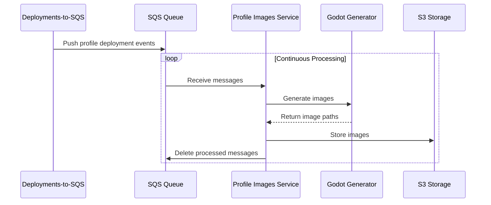

# Profile Images Service

[](https://coveralls.io/github/decentraland/profile-images?branch=coverage)

This service generates profile images from users' 3D avatar models, producing both body and face images. These images are stored in S3 and exposed via an API, allowing them to be seamlessly integrated into any desired application.

This server interacts with Catalyst for profile entity monitoring, AWS SQS for rendering job queues, and AWS S3 for image storage in order to provide applications with 2D profile images generated from 3D avatar models.

## Table of Contents

- [Features](#features)
- [Dependencies](#dependencies)
- [API Documentation](#api-documentation)
- [Getting Started](#getting-started)
  - [Prerequisites](#prerequisites)
  - [Installation](#installation)
  - [Configuration](#configuration)
  - [Running the Service](#running-the-service)
- [Testing](#testing)

## Features

- **Profile Image Generation**: Generates 2D profile images (body and face) from 3D avatar models
- **Producer-Consumer Pattern**: Monitors profile changes via Catalyst and processes rendering jobs via SQS
- **Automatic Processing**: Detects new/updated profiles and automatically queues rendering jobs
- **Retry Mechanism**: Supports retry queue for failed rendering jobs
- **CDN Integration**: Stores generated images in S3 for CDN distribution
- **REST API**: Exposes API endpoints for retrieving generated profile images

## Dependencies

- **[Catalyst](https://github.com/decentraland/catalyst)**: Content server for profile entity fetching and pointer changes monitoring
- **AWS SQS**: Message queue for rendering jobs and retry queue
- **AWS S3**: Object storage for generated profile images
- **LocalStack** (for local development): Local AWS services emulation

## API Documentation

The service provides REST API endpoints for retrieving generated profile images. See the service code for endpoint documentation.

## Getting Started

### Prerequisites

Before running this service, ensure you have the following installed:

- **Node.js**: Version 20.x or higher (LTS recommended)
- **Yarn**: Version 1.22.x or higher
- **Docker**: For containerized deployment and local development dependencies

### Installation

1. Clone the repository:

```bash
git clone https://github.com/decentraland/profile-images.git
cd profile-images
```

2. Install dependencies:

```bash
yarn install
```

3. Build the project:

```bash
yarn build
```

### Configuration

The service uses environment variables for configuration. Copy the example file and adjust as needed:

```bash
cp .env.default .env
```

See `.env.default` for available configuration options.

### Running the Service

#### Setting up the environment

In order to successfully run this server, external dependencies such as message queues and storage must be provided.

For local development, this repository provides you with a `docker-compose.yml` file that includes LocalStack for AWS services emulation. In order to get the environment set up, run:

```bash
docker-compose up -d
```

This will start:

- LocalStack (SQS and S3 emulation) on port `4566`

#### Running in development mode

Once the environment is set up, start the service:

```bash
yarn start
```

The service will:

- Poll Catalyst for profile changes
- Process rendering jobs from SQS
- Generate profile images
- Upload images to S3

## Testing

This service includes comprehensive test coverage.

### Running Tests

Run all tests:

```bash
yarn test
```

Run tests with coverage:

```bash
yarn test:coverage
```

Run only unit tests:

```bash
yarn test test/unit
```

Run only integration tests:

```bash
yarn test test/integration
```

### Test Structure

- **Unit Tests**: Test individual components and functions in isolation
- **Integration Tests**: Test the complete rendering workflow

For detailed testing guidelines and standards, refer to our [Testing Standards](https://github.com/decentraland/docs/tree/main/development-standards/testing-standards) documentation.

## Architecture

The service uses a producer-consumer pattern:



**Workflow:**

1. Producer polls Catalyst for profile changes
2. Detects new/updated profiles, queues rendering job to SQS
3. Consumer receives job, fetches avatar data
4. Consumer renders 3D avatar to 2D images (body, face)
5. Consumer uploads images to S3
6. Images served via CDN for applications

## Comparing Images

For debugging and comparison purposes, you can generate a list of entities and compare images:

```bash
http https://peer.decentraland.org/content/deployments | jq '.deployments[] | select(.entityType == "profile") | .entityId' | cut -d\" -f2  | sort | uniq > entities
cat entities | bin/compare.sh
```

## AI Agent Context

For detailed AI Agent context, see [docs/ai-agent-context.md](docs/ai-agent-context.md).

---

**Note**: This service requires a 3D rendering pipeline (Godot or similar) to generate images from avatar models. Ensure the rendering service is properly configured before running the service.
